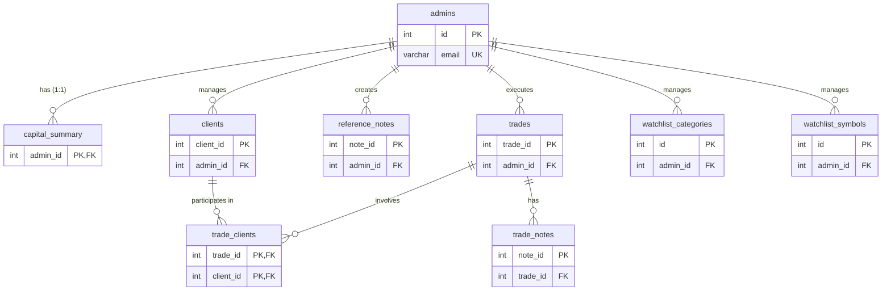

# TradeSphere Database Schema Documentation

This document provides a comprehensive overview of the TradeSphere application's database schema, including the Entity-Relationship (ER) diagram, table structures, and relationships.

## Entity-Relationship (ER) Diagram

---

## Detailed Table Structures

### 1. `admins`
Stores authentication, profile data, and preferences for system administrators. Each admin acts as a tenant in the system.

| Column Name | Data Type | Constraints | Description |
| :--- | :--- | :--- | :--- |
| `id` | INT | PRIMARY KEY, AUTO_INCREMENT | Unique identifier for the admin. |
| `name` | VARCHAR(255) | NOT NULL | Full name of the admin. |
| `email` | VARCHAR(255) | NOT NULL, UNIQUE | Email address for login. |
| `password_hash` | VARCHAR(255) | NOT NULL | Bcrypt hashed password. |
| `role` | VARCHAR(50) | DEFAULT 'admin' | User role/permissions. |
| `phone` | VARCHAR(20) | DEFAULT NULL | Contact number. |
| `bio` | TEXT | DEFAULT NULL | Short biography or description. |
| `location` | VARCHAR(255) | DEFAULT NULL | Admin location. |
| `trading_style` | VARCHAR(100) | DEFAULT NULL | Preferred trading style (e.g., Swing, Intraday). |
| `avatar_url` | VARCHAR(555) | DEFAULT NULL | URL to profile picture. |
| `preferences` | JSON | DEFAULT NULL | User UI preferences (e.g., theme settings). |
| `created_at` | TIMESTAMP | DEFAULT CURRENT_TIMESTAMP | Record creation timestamp. |

### 2. `capital_summary`
A single-row summary table per admin to cache total capital and PnL metrics for quick dashboard rendering.

| Column Name | Data Type | Constraints | Description |
| :--- | :--- | :--- | :--- |
| `admin_id` | INT | PRIMARY KEY, FOREIGN KEY | Links to `admins.id` (ON DELETE CASCADE). |
| `total_capital` | DECIMAL(15,2) | DEFAULT '0.00' | Total capital available for trading. |
| `total_pnl` | DECIMAL(15,2) | DEFAULT '0.00' | Cumulative Profit and Loss. |
| `deployed_capital` | DECIMAL(15,2) | DEFAULT '0.00' | Capital currently deployed in active trades. |

### 3. `clients`
Tracks individual clients managed by the consultancy.

| Column Name | Data Type | Constraints | Description |
| :--- | :--- | :--- | :--- |
| `client_id` | INT | PRIMARY KEY, AUTO_INCREMENT | Unique identifier for the client. |
| `name` | VARCHAR(255) | NOT NULL | Client's full name. |
| `broker` | VARCHAR(255) | DEFAULT NULL | Broker name used by the client. |
| `capital_invested` | DECIMAL(15,2) | DEFAULT '0.00' | Total capital invested by the client. |
| `join_date` | DATE | DEFAULT NULL | Date the client joined. |
| `status` | ENUM | DEFAULT 'ACTIVE' | Client status ('ACTIVE', 'INACTIVE', 'PENDING'). |
| `admin_id` | INT | FOREIGN KEY | Links to `admins.id` (ON DELETE CASCADE). |
| `is_deleted` | TINYINT(1) | DEFAULT '0' | Soft delete flag. |
| `created_at` | TIMESTAMP | DEFAULT CURRENT_TIMESTAMP | Record creation timestamp. |
| `deleted_at` | TIMESTAMP | DEFAULT NULL | Soft delete timestamp. |

### 4. `trades`
The core table logging detailed trade metrics, execution details, and post-trade analysis.

| Column Name | Data Type | Constraints | Description |
| :--- | :--- | :--- | :--- |
| `trade_id` | INT | PRIMARY KEY, AUTO_INCREMENT | Unique identifier for the trade. |
| `stock_name` | VARCHAR(255) | NOT NULL | Name/Symbol of the traded instrument. |
| `trade_type` | VARCHAR(50) | NOT NULL | Direction of the trade (e.g., LONG, SHORT). |
| `mode` | VARCHAR(50) | NOT NULL | Trading mode (e.g., INTRADAY, SWING). |
| `leverage` | DECIMAL(5,2) | DEFAULT '1.00' | Leverage multiplier used. |
| `entry_price` | DECIMAL(15,2) | NOT NULL | Average entry price. |
| `quantity` | INT | NOT NULL | Number of shares/contracts. |
| `target` | DECIMAL(15,2) | DEFAULT NULL | Target exit price. |
| `stop_loss` | DECIMAL(15,2) | DEFAULT NULL | Stop loss price. |
| `strategy` | VARCHAR(255) | DEFAULT NULL | Strategy used for the trade. |
| `conviction_level` | VARCHAR(50) | DEFAULT NULL | Confidence level in the trade. |
| `entry_nifty_mood` | VARCHAR(255) | DEFAULT NULL | Broader market sentiment at entry. |
| `entry_notes` | TEXT | DEFAULT NULL | Pre-trade analysis notes. |
| `trade_date` | DATE | DEFAULT NULL | Date the trade was executed. |
| `status` | ENUM | DEFAULT 'OPEN' | Trade status ('OPEN', 'CLOSED'). |
| `exit_price` | DECIMAL(15,2) | DEFAULT NULL | Average exit price. |
| `exit_nifty_mood` | VARCHAR(255) | DEFAULT NULL | Broader market sentiment at exit. |
| `exit_reason` | VARCHAR(255) | DEFAULT NULL | Primary reason for exiting the trade. |
| `exit_emotion` | VARCHAR(255) | DEFAULT NULL | Emotional state during exit. |
| `conclusion` | TEXT | DEFAULT NULL | Post-trade review and learnings. |
| `total_pnl` | DECIMAL(15,2) | DEFAULT NULL | Total Profit/Loss realized. |
| `exit_date` | DATE | DEFAULT NULL | Date the trade was closed. |
| `admin_id` | INT | FOREIGN KEY | Links to `admins.id` (ON DELETE CASCADE). |
| `is_deleted` | TINYINT(1) | DEFAULT '0' | Soft delete flag. |
| `created_at` | TIMESTAMP | DEFAULT CURRENT_TIMESTAMP | Record creation timestamp. |
| `closed_at` | TIMESTAMP | DEFAULT NULL | Trade closure timestamp. |
| `deleted_at` | TIMESTAMP | DEFAULT NULL | Soft delete timestamp. |

### 5. `trade_clients`
A junction table representing a Many-to-Many relationship between `trades` and `clients`.

| Column Name | Data Type | Constraints | Description |
| :--- | :--- | :--- | :--- |
| `trade_id` | INT | PRIMARY KEY, FOREIGN KEY | Links to `trades.trade_id` (ON DELETE CASCADE). |
| `client_id` | INT | PRIMARY KEY, FOREIGN KEY | Links to `clients.client_id` (ON DELETE CASCADE). |

### 6. `trade_notes`
Stores running notes and updates associated with specific active trades.

| Column Name | Data Type | Constraints | Description |
| :--- | :--- | :--- | :--- |
| `note_id` | INT | PRIMARY KEY, AUTO_INCREMENT | Unique identifier for the note. |
| `trade_id` | INT | FOREIGN KEY | Links to `trades.trade_id` (ON DELETE CASCADE). |
| `note_text` | TEXT | NOT NULL | Content of the note. |
| `created_at` | TIMESTAMP | DEFAULT CURRENT_TIMESTAMP | Record creation timestamp. |

### 7. `reference_notes`
Stores uploaded documents, research notes, and market observations.

| Column Name | Data Type | Constraints | Description |
| :--- | :--- | :--- | :--- |
| `note_id` | INT | PRIMARY KEY, AUTO_INCREMENT | Unique identifier for the reference note. |
| `title` | VARCHAR(255) | NOT NULL | Title of the note or document. |
| `content` | TEXT | DEFAULT NULL | Rich text content. |
| `file_name` | VARCHAR(255) | DEFAULT NULL | System-stored file name for attachments. |
| `original_file_name`| VARCHAR(255) | DEFAULT NULL | Original file name of the uploaded document. |
| `file_type` | VARCHAR(100) | DEFAULT NULL | MIME type or extension of the file. |
| `admin_id` | INT | FOREIGN KEY | Links to `admins.id` (ON DELETE CASCADE). |
| `created_at` | TIMESTAMP | DEFAULT CURRENT_TIMESTAMP | Record creation timestamp. |
| `updated_at` | TIMESTAMP | DEFAULT CURRENT_TIMESTAMP | Record update timestamp. |

### 8. `watchlist_categories`
Manages organizational categories for watchlisted symbols.

| Column Name | Data Type | Constraints | Description |
| :--- | :--- | :--- | :--- |
| `id` | INT | PRIMARY KEY, AUTO_INCREMENT | Unique identifier for the category. |
| `name` | VARCHAR(50) | NOT NULL | Category name (e.g., 'Breakout', 'Value'). |
| `admin_id` | INT | FOREIGN KEY | Links to `admins.id` (ON DELETE CASCADE). |
| `created_at` | TIMESTAMP | DEFAULT CURRENT_TIMESTAMP | Record creation timestamp. |

*Note: Enforces a unique constraint on `(name, admin_id)`.*

### 9. `watchlist_symbols`
Manages stocks under observation for potential future trades.

| Column Name | Data Type | Constraints | Description |
| :--- | :--- | :--- | :--- |
| `id` | INT | PRIMARY KEY, AUTO_INCREMENT | Unique identifier for the watchlist item. |
| `symbol` | VARCHAR(255) | NOT NULL | Stock ticker or symbol. |
| `name` | VARCHAR(255) | DEFAULT NULL | Full company name. |
| `category` | VARCHAR(50) | DEFAULT 'Short' | The category this symbol falls under. |
| `admin_id` | INT | FOREIGN KEY | Links to `admins.id` (ON DELETE CASCADE). |
| `created_at` | TIMESTAMP | DEFAULT CURRENT_TIMESTAMP | Record creation timestamp. |

*Note: Enforces a unique constraint on `(symbol, admin_id)`.*
